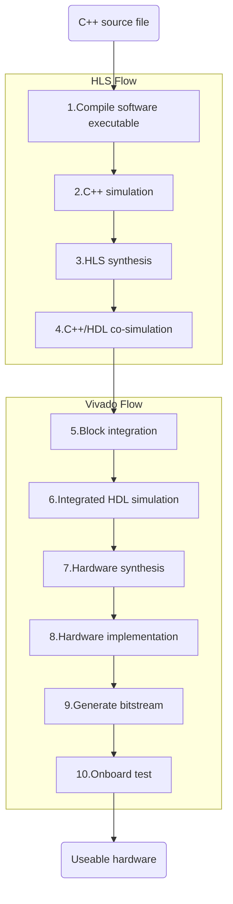
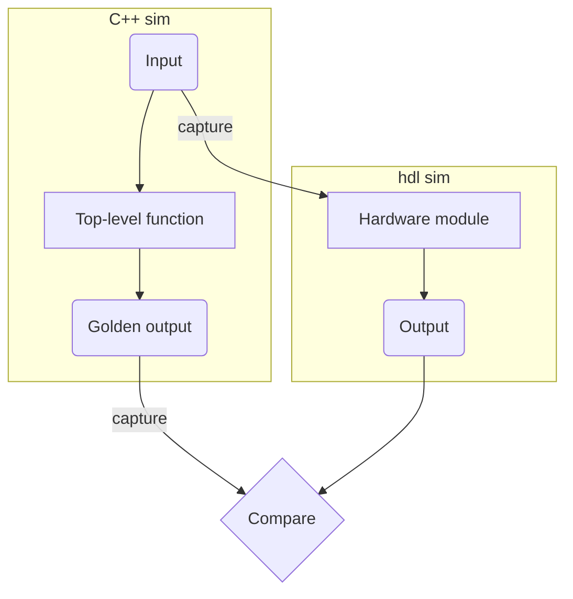
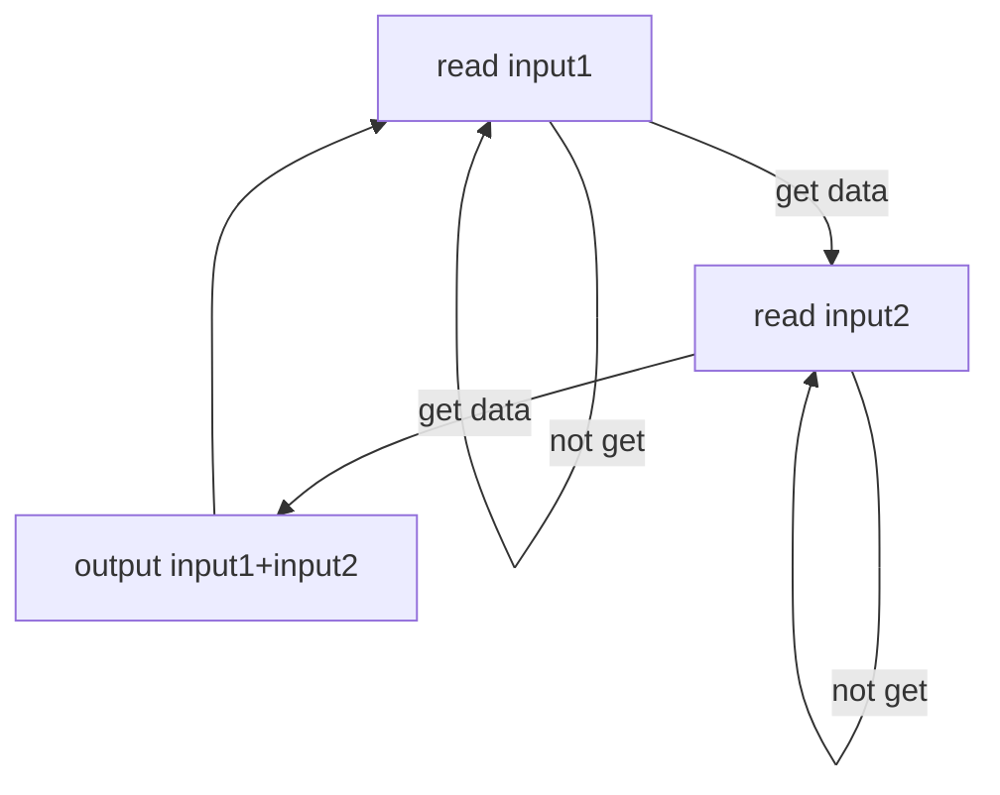

# HLS Experience

I have been using Vivado HLS (now [Vitis HLS](https://www.xilinx.com/products/design-tools/vivado/integration/esl-design.html)) during the past two years. In 2018 I interned in Prof. [Zhiru Zhang](https://www.csl.cornell.edu/~zhiruz/index.html)'s group (who had co-founded AutoESL, which was later acquired by Xilinx and became Vivado HLS) building ML accelerators. From 2019 to 2020 I worked at UCSD building network devices. Here are the experiences I have obtained during my previous development.

## Introduction

High-Level Synthesis, a.k.a. HLS, is a technique that transforms C/C++ software code into hardware description language (Verilog/VHDL/System C) while preserves its logic functionality (a compiler, indeed). In most cases, HLS ensures that the behavior of the synthesized hardware strictly follows the behavior of the software code. That property makes it possible to simulate the hardware behavior using software code. However, the software simulation is mainly used during early-stage verification to quickly identify errors, thus hardware simulation is still needed to examine detailed hardware behavior.

Not all C/C++ software codes can be directly used for HLS. Software codes must follow certain constraints (briefly, only basic and HLS library data structures and APIs, no recursion, etc.) to be synthesizable. Various compiler hints can be added into codes via `#pragma` directives for HLS to generate optimized architecture, such as parallel and pipeline. However, special techniques and intense care need to be taken to make the optimized architecture useable and efficient. Those techniques usually make the software code written in a way totally different from ordinary software codes (but still compilable with software compiler like g++). Generally, you are just using a C/C++ based hardware description language and you still need to have a deep understanding of underlying architecture and hardware.

## Design Flow

Below is the workflow of FPGA development using HLS. Steps 1 to 4 are procedures within Vivado HLS and the remaining steps are procedures within Vivado Design Suite. Failing at any step can result in reasoning the cause from the initial source code.



### HLS Flow

Usually the hardware module we want to generate is written as a function in C++. The parameters and return value of that function will become the input/output interface of the hardware module. There can be only one top-level module within one HLS project, thus there can be only one top-level function within the source code, i.e. the call-tree can only have one root. Apart from the source code, you also need to write a testbench in C++. The basic requirement is to make the code software compilable. Then the top-level function in the source code will be exercised within the testbench to check the input/output and/or inner behavior are as desired. After that, HLS will transform the source code into HDL of the hardware module, this step is called HLS synthesis. Note that source code is software compilable doesn't guarantee that HLS synthesis will be successful.

The last step, co-simulation, is to verify that the input/output we obtained from C++ simulation match the input/output of HDL simulation. If the software simulation succeed and the co-simulation passed, then the module is fine-to-go. The co-sim will first exercise the top-level function and capture the input/output to/from the function during the execution of the software testbench. The input will be used as the data to feed the hardware module, and the output will be used as *golden result*. Then co-sim will automatically simulate the synthesized HDL with the input and compare its output with *golden result*. If the result matches, then the co-simulation is considered successful.  Co-sim has its limitations, depending on the complexity of the synthesized hardware module and the scale of input, the time co-simulation takes ranges from seconds to hours, even days. Deadlock or incorrect results may also occur if certain constraints are not met.




### Vivado Flow

This part is the same for HLS or directly writing HDL. Usually I generate multiple modules using HLS and assemble them in the block diagram. Then a block-level testbench is used to simulate the whole block. During the synthesis step Vivado will generate netlist (circuit diagram, indeed) from HDL. The implementation step will cover the task of routing, optimization, placement, etc. to prepare the actual physical layout on the FPGA. Those information is written into a bitstream in a [special format](http://lastweek.io/fpga/bitstream/). After the FPGA is programmed with a bitstream, the hardware is ready to run.

## Two Ways of Using HLS

Based on my experience, I categorize the usage of HLS into two different ways, **memory processing** and **stream processing**, which has different coding style and use cases.

### Memory Processing

Memory processing HLS modules directly operate on data within the memory, usually BRAM (block RAM) in FPGA. This way is mostly used in applications like ML. Consider the simple case of  multiplying two 10×10 matrixes. The C++ software code will be like this:

```c++
void matmul(int a[10][10], int b[10][10], int c[10][10]) {
	for (int i = 0; i < 10; i++) {
		for (int j = 0; j < 10; j++) {
			int sum = 0;
			for (int k = 0; k < 10; k++)
				sum += a[i][k] * b[k][j];
			c[i][j] = sum;
		}
	}
}

/** report
+-----+-----+-----+-----+---------+
|  Latency  |  Interval | Pipeline|
| min | max | min | max |   Type  |
+-----+-----+-----+-----+---------+
| 4221| 4221| 4221| 4221|   none  |
+-----+-----+-----+-----+---------+
**/
```

This piece of code is HLS synthesizable. The logic of the synthesized module is every time the module is invoked, it will do the matrix multiplication once, reading data from matrix `a` and `b`, and writing the result into matrix `c`. `a`, `b`, and `c` are indeed memory-mapped interface, which takes an address (and a data) to perform an read/write operation. In this case, `a` and `b` are input interfaces, and `c` is an output interface. They may be connected to BRAMs outside this module.

According to the generated synthesis report, the whole multiplication takes 4221 cycles. To make this module run faster, optimizations need to be applied. Loop unroll and pipeline are two most used techniques in HLS. First add directives to unroll the inner-most loop:

```c++
void matmul(int a[10][10], int b[10][10], int c[10][10]) {
#pragma HLS ARRAY_PARTITION variable=a dim=2
#pragma HLS ARRAY_PARTITION variable=b dim=1
	for (int i = 0; i < 10; i++) {
		for (int j = 0; j < 10; j++) {
			int sum = 0;
			for (int k = 0; k < 10; k++)
			#pragma HLS UNROLL
				sum += a[i][k] * b[k][j];
			c[i][j] = sum;
		}
	}
}

/** report
+-----+-----+-----+-----+---------+
|  Latency  |  Interval | Pipeline|
| min | max | min | max |   Type  |
+-----+-----+-----+-----+---------+
|  421|  421|  421|  421|   none  |
+-----+-----+-----+-----+---------+
**/
```

The `UNROLL` directive is added into the inner-most loop to make the 10 multiplications run in parallel, that is, there are 10 multipliers instead of 1. Apart from that, the module needs to read `a[i][k]` and `b[k][j]` for `k`=1..10 in parallel. Thus, the `ARRAY_PARTITION` directive is applied to `a` on dimension 2 and `b` on dimension 1. What's happening here is there are 10 interfaces for both `a` and `b` (their connected BRAMs also need to be partitioned from 1 memory slice into 10 memory slices), each interface maps to 1 memory slice. By unrolling, the time decrease to 1/10.

More optimization can be applied. Add directive to pipeline the second loop:

```c++
void matmul(int a[10][10], int b[10][10], int c[10][10]) {
#pragma HLS ARRAY_PARTITION variable=a dim=2
#pragma HLS ARRAY_PARTITION variable=b dim=1
	for (int i = 0; i < 10; i++) {
		for (int j = 0; j < 10; j++) {
		#pragma HLS PIPELINE
			int sum = 0;
			for (int k = 0; k < 10; k++)
			#pragma HLS UNROLL
				sum += a[i][k] * b[k][j];
			c[i][j] = sum;
		}
	}
}

/** report
+-----+-----+-----+-----+---------+
|  Latency  |  Interval | Pipeline|
| min | max | min | max |   Type  |
+-----+-----+-----+-----+---------+
|  104|  104|  104|  104|   none  |
+-----+-----+-----+-----+---------+
**/
```

The `PIPELINE` directive is added into the second loop, which pipelines all operations within that loop. Note that all inner loops within a pipelined loop will be automatically unrolled. Here is the log for applying the pipeline directive:

```
INFO: [SCHED 204-11] Starting scheduling ...
INFO: [SCHED 204-61] Pipelining loop 'Loop 1'.
INFO: [SCHED 204-61] Pipelining result : Target II = 1, Final II = 1, Depth = 4.
INFO: [SCHED 204-11] Finished scheduling.
```

Here **II** refers to *initiation interval*, which means the number of cycles that must elapse between issuing two operations of a given type (definition from Computer Architecture: A Quantitative Approach, sixth edition). "Depth = 4" means all operations within the second loop takes 4 cycles to complete (after unrolling the inner-most loop). "II = 1" means we can issue such a operation (compute on a new index `j`) every cycle. After pipelining, the time further decrease to 1/4.

Ideally, we always want II=1. However, HLS can fail to achieve that, mainly because of data dependency (data hazard). Resolving such kind of issue can be very tricky in some cases, which typically results in codes being written in an unnatural way.

Generally, the code style of memory processing HLS codes is not much different from normal software codes. The main difference is adding some directives. Sometimes the loop structure is changed by loop tiling to accommodate to hardware constraints.

### Stream Processing

Stream processing HLS modules operate on data streams, through a stream interface (e.g. [AXI-Stream](https://developer.arm.com/documentation/ihi0051/a/Introduction/About-the-AXI4-Stream-protocol)). This way is used in applications such as packet processing. Consider the simple case of a packet processor, which takes input from a int data stream, add the values of two continuous inputs, and outputs the result to the output data stream. A straight-forward way to write this module is:

```c++
#include <hls_stream.h>

void pktproc(hls::stream<int> &in, hls::stream<int> &out) {
#pragma HLS INTERFACE ap_ctrl_none port=return
#pragma HLS PIPELINE
	int input1, input2;

	input1 = in.read();
	input2 = in.read();
	out.write(input1 + input2);
}
```

This piece of code is HLS synthesizable. However, trying to pipeline it generates the following logs:

```
INFO: [SCHED 204-11] Starting scheduling ...
INFO: [SCHED 204-61] Pipelining function 'pktproc'.
WARNING: [SCHED 204-68] The II Violation in module 'pktproc' (Function: pktproc): Unable to enforce a carried dependence constraint (II = 1, distance = 1, offset = 1)
   between fifo read on port 'in_V' (pkt.cpp:32) and fifo read on port 'in_V' (pkt.cpp:31).
INFO: [SCHED 204-61] Pipelining result : Target II = 1, Final II = 2, Depth = 3.
INFO: [SCHED 204-11] Finished scheduling.
```

HLS can't schedule the two reads on the same input interface `in`. Thus we need to write it in another way. The solution is to extract the states and state transition within the code, and explicitly express them in C++. The state transition diagram and modified code are as follow.



```c++
#include <hls_stream.h>

enum status {
	STATE_IN,
	STATE_OUT
};

void pktproc(hls::stream<int> &in, hls::stream<int> &out) {
#pragma HLS INTERFACE ap_ctrl_none port=return
#pragma HLS PIPELINE
	static enum status state = STATE_IN;
	static int input1, input2;
	
	switch (state) {
		case STATE_IN:
			if (in.empty())
				break;
			input1 = in.read();
			state = STATE_OUT;
			break;
		case STATE_OUT:
			if (in.empty())
				break;
			input2 = in.read();
			out.write(input1 + input2);
			state = STATE_IN;
			break;
		default:
			break;
	}
}
```

This code partitions the procedure into 2 stages, each within a `case` statement. The two reads on `in` interface are separated into different stages. Now HLS can achieve II=1.

The code style differs greatly from traditional software code. In fact, it's more like writing an FSM using HDL, as it describes the behavior under different states, and the transition between them. The logic of this code is, every time the module is invoked, it will execute the operations within a `case` statement, based on the current `state`. The `#pragma HLS INTERFACE ap_ctrl_none port=return` directive means the module will invoke itself once and once again as long as the power and clock signal is on, instead of waiting for external start signal. Thus, after each invocation, the module will transit to the next state (`static` ensures that the state is preserved between invocations) and may perform new operations if the state is changed.

The `stream<type>` in function parameter list is a queue-like data structure, which will be synthesized into a stream interface. At the start of `case` statement, we check if the data is ready on the stream interface. If there is no data, the code will just terminate. This is mainly for the ease of software simulation, since `read()` will be blocked if it's called on an empty stream. Checking whether the stream is empty makes the whole function non-block, so we can test it in the following way:

```c++
// populate test data
for (i = 1:test_size)
	in.write(test_data[i]);

for (c = 1:num_test_cycle) {
	pktproc(in, out);
	// check output
}
```

Generally, the steps for writing a stream processing module can be concluded as follow:

1. Partition the processing procedure into several stages.
2. Determine the operations within each stage.
3. Determine the transition among different stages. And check there is no dead state.
4. Based on the pipelining result, adjust operations within stages, or partition one stage into finer stages.

There is no golden rule for doing this, it's mostly based on experience, as well as trial and error. And it can still be very tricky to achieve II=1 in some cases, like that in memory processing modules.

## Limitations

Despite the various advantages of designing hardware using C++, HLS has several major limitations. Those limitations mainly come from the essential differences between C++ and HDL. C++ describes **procedures**, which have the property of sequential execution. HDL describes **behaviors**, which has the property of concurrency.

### Lack of Transparency

Most developers don't understand how HLS converts C++ into HDL (those who are interested in that can check Zhiru Zhang's [publications](https://www.csl.cornell.edu/~zhiruz/publications.html) during his PhD). And the convertibility is not obvious comparing with converting C++ into assembly. In fact, HLS compiler is less reliable than C++ software compiler. In a few cases, it can be buggy, and result in unexpected behavior in generated hardware modules. However, the generated HDL code is usually extremely complex, making it nearly impossible to understand or diagnose any issue from it. Thus, if such things happen, one can only inspect the source C++ code to resolve issues, but the indirect layer between C++ and HDL adds the difficulty. Generally, HLS makes direct reasoning about hardware more difficult.

### Difficulty in Task-level Parallelism

One task that is difficult for HLS to accomplish is to generate task-level parallelism architecture. e.g., to overlap data loading with computation during memory-intensive operations in ML. This is because C++ itself cannot express task-level parallelism due to its sequential property. HLS tries to workaround this by providing a `DATAFLOW` directive, which tries to generate task-level pipeline of different functions. However, it's difficult to use since the requirement for the code is too strict thus HLS often fails to apply the `DATAFLOW` directive.

### Efficiency Issue

Some are saying that the modules generated by HLS are less efficient than hand-written ones, both in terms of resource utilization and performance. This might be true, HLS generated module can be less efficient than that written by an experienced engineer. But considering the difficulty of crafting a hardware module by hand, especially for those pipeline and parallel architecture, the tradeoff worth it.